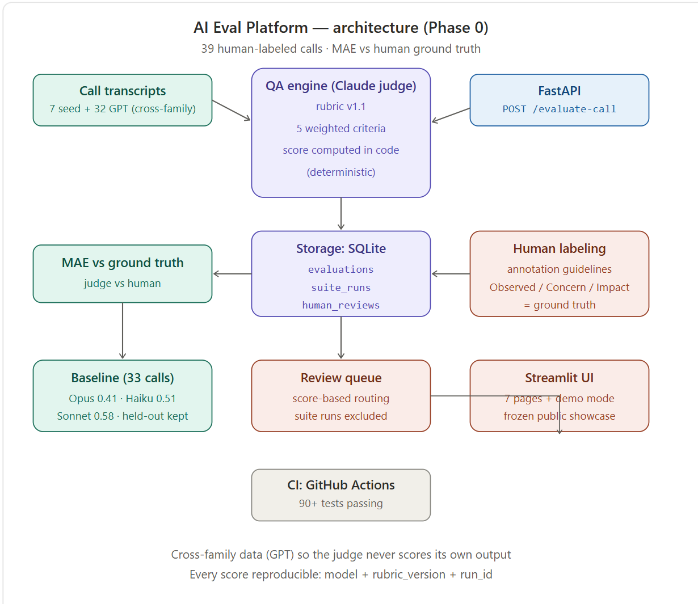

# Healthcare Call QA — LLM-as-Judge Evaluation Platform

[](https://github.com/evgeniia-ai/ai-eval-agent/actions/workflows/ci.yml)

An automated quality-assurance system for healthcare contact-center calls. An LLM judge scores transcripts against a structured rubric, routes risky calls to a human review queue, and exposes the evaluator as a REST API.

---

## 🔗 Live Demo
**[Try it in your browser — no setup, no API key](https://ai-eval-platform-hs8guv2hxng87gufdugzsb.streamlit.app)**

Frozen results from a real evaluation run: 39 human-labeled calls scored by 3 judge models (Opus, Sonnet, Haiku), honest human-only MAE. Includes the Review Queue and the human-annotation UI (read-only) so you can see how the ground truth itself was built. Live evaluation available when running locally with your own key.

---

## Overview

The system evaluates patient-facing call transcripts across five weighted quality dimensions using Claude as the judge. Evaluations are stored in a shared SQLite database that backs both a Streamlit admin dashboard and a FastAPI endpoint. Calls that trip quality or safety thresholds are automatically routed to a human review queue; the same routing logic fires whether an evaluation originates from the UI, the ingestion pipeline, or the API.

The self-improvement loop reads stored evaluations per representative, identifies recurring weaknesses, and generates a personalized coaching summary. A `coaching_directive_for_prompt()` helper produces a system-prompt directive ready to inject into a call-assist agent; the integration point is provided, but no live agent is wired up in this project.

---

## Dataset

**39 human-labeled calls** (7 seed + 32 cross-family GPT-generated), labeled by hand against written annotation guidelines, with a held-out test split.

- **7 seed calls** — hand-crafted, human ground truth from the original brief.
- **32 GPT-generated calls** — synthetic transcripts from a *different* model family than the judge (GPT, not Claude), imported and validated (`scripts/import_gpt_transcripts.py`), then hand-labeled on the same Labeling page.
- **6 held out** (`scripts/make_holdout.py`, stratified by call type) — never used for model selection or MAE tracking, leaving **33 calls** for calibration.

## Final Baseline

MAE vs. human ground truth on the 33-call calibration set (lower is better):

| Model | MAE vs GT |
|---|---|
| **Opus 4.8** | **0.41** |
| Haiku 4.5 | 0.51 |
| Sonnet 4.6 | 0.58 |

## Key Findings

- **Synthetic ground truth was circular.** Calls generated *and* graded by the same Claude model family scored artificially well against each other (self-preference bias) — fixed by excluding same-family synthetic pairs from every MAE calculation, and by switching to cross-family (GPT-generated) synthetic data for genuine calibration going forward.
- **Annotation drift was measurable — and large.** Re-labeling the 7 seed calls under written guidelines shifted scores by a mean absolute delta of **0.61** (Protocol Adherence least stable at 1.0, Identity Verification fully stable at 0.0). Some of the judge's apparent "error" was actually inconsistent ground truth, not a bad judge.
- **The cheapest model is competitive.** Haiku 4.5 (0.51 MAE) lands within ~0.1 of Opus 4.8 (0.41 MAE) at a fraction of the cost — a real cost/quality tradeoff to make deliberately, not a reason to default to the most expensive model.

---

## Features

- **LLM-as-judge evaluation** across a five-dimension rubric (weighted, versioned). Weighted overall score is computed in code — not by the model — so scoring is deterministic. Rubric version stored per evaluation row for full traceability.
- **Per-run history** — each evaluation is a separate row; the dashboard shows the full run history per call and a run selector for drill-down.
- **Eval suites** (Smoke / Regression / Full) with per-run tracking: n evaluated, n failed, n skipped, mean overall, MAE vs human ground truth. Full runs the entire 33-call calibration set.
- **Judge-model comparison** — Opus 4.8, Sonnet 4.6, and Haiku 4.5 are selectable in the UI; MAE vs ground truth is charted per model across suite runs to support cost/quality trade-off decisions.
- **Score-based Human Review Queue routing** — routes on risk, not call type alone: overall score < 2.5, any dimension ≤ 1, identity verification ≤ 2 (privacy), and type-specific risk (`clinical_triage` with protocol adherence or accuracy ≤ 2; `prescription_refill` with protocol adherence ≤ 2) — a clean triage or refill call no longer routes just for being that type. Calibration/suite runs never route (only real production-style evaluations do). Reviewers can mark as Confirmed Issue / False Alarm / Needs Rubric Update with optional notes.
- **Human annotation UI** — a dedicated Labeling page for scoring GPT-generated and seed calls by hand, capturing evidence in a structured **Observed / Concern / Impact** format rather than free-form notes, against written annotation guidelines (score anchors + per-call-type expectations).
- **Cross-family synthetic data generation** — a GPT-generated call set (different model family than the judge) avoids the self-preference bias of same-family synthetic ground truth, plus a Claude-based scenario-matrix generator (call types × quality levels × edge cases) for broader coverage.
- **Held-out validation split** — a stratified holdout carved out of the labeled set and excluded from every calibration run, so model-selection MAE isn't measured on the same data used to tune anything.
- **FastAPI evaluator endpoint** (`POST /evaluate-call`) — same evaluation logic, same DB, same review routing as the UI. Returns `run_id` so callers can reference the stored record.
- **Self-improvement loop** — per-rep coaching summaries generated by Claude; `coaching_directive_for_prompt()` produces a ready-to-inject system-prompt directive (integration point provided; no live agent wired up).

---

## Project structure

```
src/
  app.py          — Streamlit admin dashboard (7 pages: Overview, Call detail,
                    Rep summary, Data generation, Test runs, Review Queue, Labeling)
  api.py          — FastAPI app; POST /evaluate-call persists to the shared DB
  qa_engine.py    — LLM-as-judge core: builds prompt, calls client.messages.parse,
                    returns a validated Evaluation dataclass
  rubric.py       — Single source of truth for dimensions, weights, RUBRIC_VERSION,
                    and weighted_overall() (deterministic, computed in code)
  review.py       — needs_review(): pure function, score-based routing triggers, no I/O
  storage.py      — SQLite store: evaluations, human_reviews, suite_runs tables;
                    save() inserts a new run row each time, preserving full
                    per-call history; routes to review queue unless
                    route_to_review=False (suite/calibration runs opt out)
  models.py       — Pydantic schemas (Transcript, TranscriptEvaluation,
                    CoachingSummary); Score = Literal[1,2,3,4,5]
  ingest.py       — Batch pipeline (load seed + generated transcripts → evaluate
                    → save) plus run_suite() for named-set suite runs
  labeling.py     — Human ground-truth labeling: load/save/validate calls for
                    both the GPT and seed sources, Observed/Concern/Impact notes
  demo_data.py    — Read-only data layer backing DEMO_MODE, sourced from the
                    frozen data/demo_results.json export instead of qa.db
  data_gen.py     — Synthetic transcript generation via Claude (DATAGEN_MODEL);
                    writes data/generated_transcripts.json
  coaching.py     — Per-rep weakness identification and CoachingSummary generation;
                    coaching_directive_for_prompt() for live-agent injection
  test_sets.py    — SMOKE_SET (5), REGRESSION_SET (9), and FULL_SET (33 —
                    dynamically computed: seed + labeled GPT calls minus holdout)
  config.py       — Shared Anthropic client (lru_cache), model resolution,
                    DB_PATH; all components import from here

scripts/
  import_gpt_transcripts.py   — Validates & imports the cross-family GPT call set
  make_holdout.py              — Carves out the stratified holdout split
  run_suites.py                — CLI suite runner (smoke/regression/full x model)
  export_demo.py               — Builds the frozen data/demo_results.json snapshot
  compare_relabels.py          — Reports annotation drift after re-labeling
  resolve_suite_run_reviews.py — Bulk-resolves review rows created by suite runs

tests/
  conftest.py     — tmp_db/tmp_gpt_path/tmp_seed_path/... fixtures (redirect
                    reads/writes to throwaway files)
  test_smoke.py   — Free unit/integration tests; no live API calls
  test_api.py     — FastAPI endpoint tests; evaluate() mocked, uses tmp_db
  test_regression.py — Gated regression tests; require a live API key
  (plus dedicated files for labeling, demo mode, holdout, and seed re-labeling)

docs/
  eval_findings.md               — Judge calibration findings, rubric iterations,
                                    the Phase 0 dataset expansion and baseline
  human-annotation-guidelines.md — Score anchors, per-call-type expectations,
                                    and the Observed/Concern/Impact evidence format
  ideas.md                        — Design ideas and future directions

data/
  seed_transcripts.json      — 7 hand-crafted, human-labeled transcripts
  gpt_transcripts.json       — 32 cross-family (GPT-generated) calls, hand-labeled
  generated_transcripts.json — Claude-generated synthetic transcripts (scenario matrix)
  holdout_ids.json           — The 6 held-out calibration call_ids
  seed_labels_v0_backup.json — Pre-relabel snapshot of the original seed labels
  demo_results.json          — Frozen export powering DEMO_MODE
  qa.db                      — SQLite database (created at runtime, gitignored)
```

---

## Quick start

```bash
# 1. Install dependencies
pip install -r requirements.txt

# 2. Set your API key — copy .env.example or create a .env file:
#    ANTHROPIC_API_KEY=sk-ant-...
#    Never commit this file; it is gitignored.

# 3. Verify the environment
python verify_setup.py

# 4. Run the Streamlit dashboard
streamlit run src/app.py          # → http://localhost:8501

# 5. (Optional) Run the FastAPI evaluator endpoint
uvicorn src.api:app --reload --port 8000   # → http://127.0.0.1:8000/docs

# 6. (Optional) Run the ingestion pipeline from the CLI
python -m src.ingest              # seed + generated transcripts
python -m src.ingest --seed       # seed only

# 7. (Optional) Generate synthetic transcripts
python -m src.data_gen
```

**Environment variables** (all optional except `ANTHROPIC_API_KEY`):

| Variable | Default | Purpose |
|---|---|---|
| `ANTHROPIC_API_KEY` | *(required)* | Anthropic API key |
| `ANTHROPIC_MODEL` | `claude-opus-4-8` | Judge model for QA evaluation and coaching |
| `DATAGEN_MODEL` | `claude-sonnet-4-6` | Model for synthetic transcript generation |
| `QA_DB_PATH` | `data/qa.db` | SQLite database path |

---

## Testing

```bash
pytest                  # runs smoke + API tests (no live API calls, fast)
pytest -v               # verbose output
```

The suite is split into two tiers:

- **Smoke / API tests** (`test_smoke.py`, `test_api.py`) — free; no live API calls. `evaluate()` is mocked where needed. All storage tests use the `tmp_db` fixture so nothing touches `data/qa.db`.
- **Regression tests** (`test_regression.py`) — gated; require a valid `ANTHROPIC_API_KEY` and make real model calls. Run separately and intentionally — they cost tokens.

---

## Architecture



---

## Architecture notes

The codebase is structured as one evaluator library (`src/`) with two thin interfaces over it:

- **Streamlit UI** (`src/app.py`) — calls `storage.*`, `ingest.run()`/`run_suite()`, `evaluate()`, `labeling.*`, and `coaching.*` directly. Suitable for a QA manager workflow. In `DEMO_MODE`, reads swap to `demo_data.py` (a frozen snapshot) and every write path is disabled.
- **FastAPI** (`src/api.py`) — exposes `POST /evaluate-call` for programmatic use. Uses the same `evaluate()` and `storage.save()` calls, so results flow into the same DB and review queue as the UI.

**Single SQLite source of truth** — `storage.py` is the only component that touches the database. `save()` is the single call site for persisting an evaluation; review routing is a side effect of `save()`, gated by a `route_to_review` flag (default `True`) rather than a separate caller concern. `ingest.run_suite()` is the one caller that passes `False` — calibration/suite runs are experiments on the judge, not production traffic, so they never queue a review.

**Human-in-the-loop layer** — `needs_review()` in `review.py` is a pure function (no I/O) that routes on risk signals, not call type alone (see Features). `storage.save()` calls it and writes a `Pending` review row automatically when routing is enabled. The Review Queue page in the dashboard closes the loop: a reviewer reads the judge's reasoning and transcript, then resolves the row.
